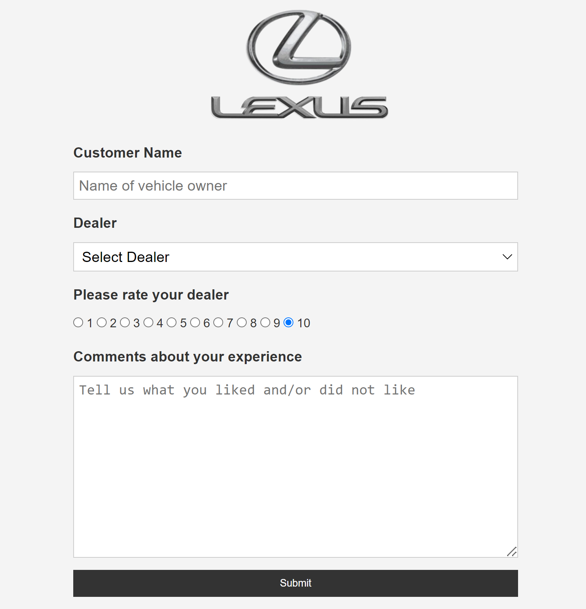

# Python Feedback App

>Python Flask Feedback app that sends data to a Postgres database and emails you a copy of the form data.



## Quick Start

```bash
# Create a .env file and add:
- DATABASE_HOSTNAME=
- DATABASE_USERNAME=
- DATABASE_PASSWORD=
- DATABASE_NAME=


# Create a https://mailtrap.io/ account and add your credentials so the send_mail.py file

# Install dependencies
pipenv shell
pipenv install

# Server on localhost:5000
python app.py
```
